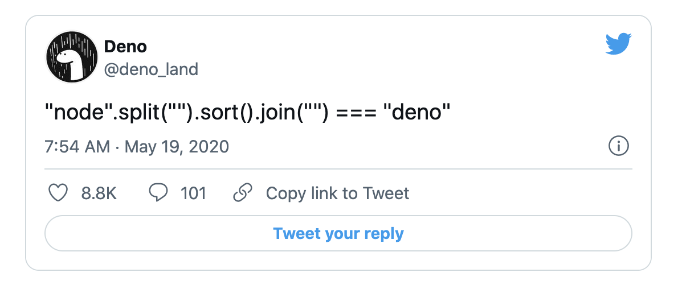
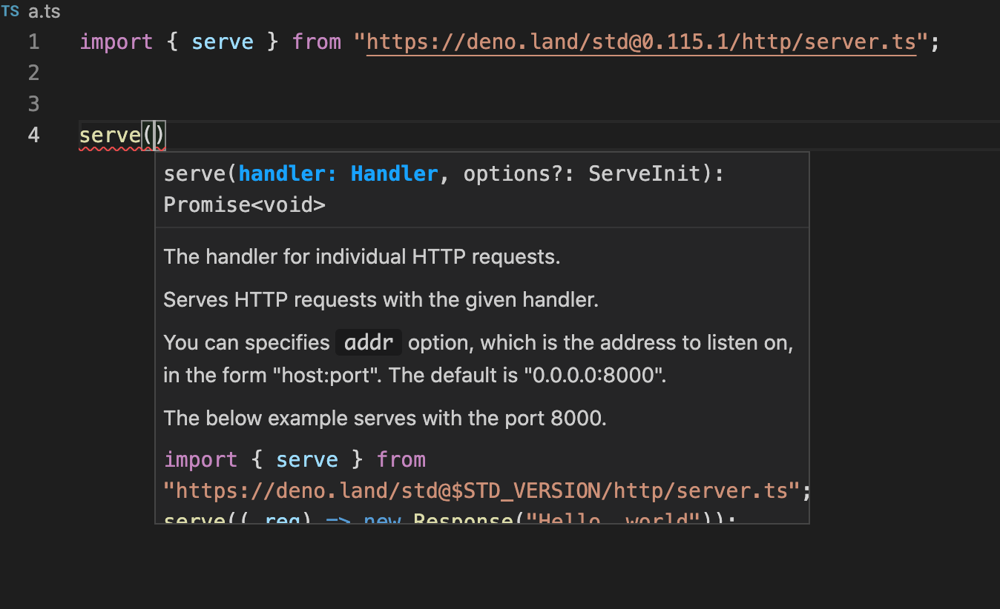
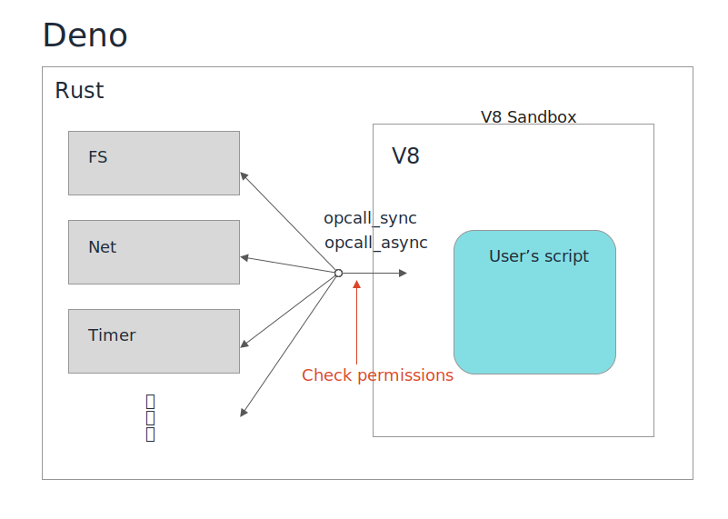
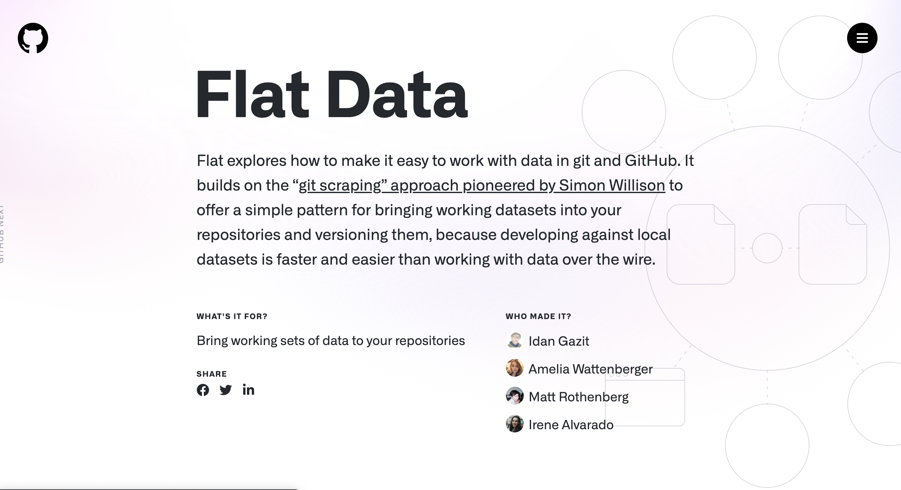
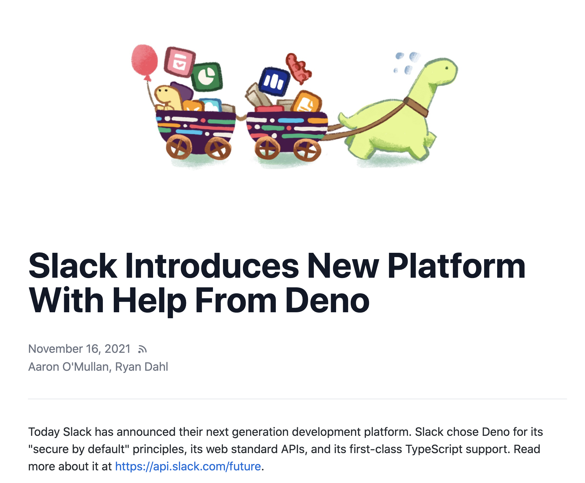
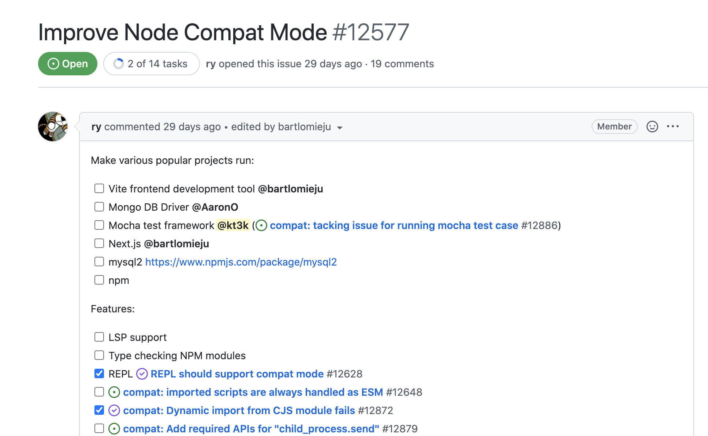

class: middle, center


Deno の これまで と これから

---
アジェンダ

- Deno とは
- Deno のこれまでのロードマップ
- Deno のこれからのロードマップ

---
# 話す人


日野澤歓也 twitter @kt3k

- GREE (2012 - 2013)
- Recruit (2015 - 2019)
- Deno Land (2021 -)

<small>2018年から Deno にコントリビュートを開始。2020年作者に誘われ Deno Land に転職。現在はフルタイムで Deno と Deno Deploy を開発中。</small>

---
class: middle center

Deno とは

---
class: inverse middle center

今から3年前

---
class: inverse middle center

とあるカンファレンス

---
class: jsconfeu2018

JSConf EU 2018

---
「Node.js について後悔している10の事」

- Node.js の作者 Ryan Dahl が Node.js の現状のデザインについて、今の視点からみて後悔している7つの事を発表
- それを克服する新しい処理系として Deno プロジェクトを提案

<p style="text-align: center">
  
</p>

---
7つの後悔

- 後悔1: Promise を使わなかった
- 後悔2: Security Sandbox を使わなかった
- 後悔3: GYP を使い続けてしまった
- 後悔4: package.json
- 後悔5: node_modules
- 後悔6: モジュール解決時の拡張子省略
- 後悔7: index.js

Node.js の「あたりまえ」を否定

---
対案としての Deno 、そのゴール

1. セキュリティ
2. ES Module
3. TypeScript ビルトイン
4. 単体の実行ファイルで動く
5. モダンな開発環境を使う
6. 可能な限り Web 互換

などの目標が掲げられた

---
class: middle center

Deno とは

---
class: middle center

Deno とは "改良版" Node.js

---
class: middle center



---
class: middle center
Deno のこれまで

---
Deno のこれまでのロードマップ
- Web 互換性
- TypeScript サポート
- V8 サンドボックスセキュリティの活用
- HTTPパフォーマンス

---
class: inverse middle center

Web 互換性

---
Web 互換性

- Deno には可能な限り Web 互換 API を取り入れるというデザイン方針がある
- サーバーサイドでも意味がある Web API を出来るだけ取り入れる

---
Web 互換性

Deno に実装されている Web API の例

- http client - fetch API
- バイナリ処理 - TypedArray API (Uint8Array, etc)
- ストリーミング処理 - Web Stream API
- URL parse - URL API
- PubSub - EventTarget API

---
Web 互換性

Deno に実装されている Web API の例

- 暗号 - Web Crypto API
- GPU - WebGPU
- http server - Request, Response API
- データ保存 - Web Storage API

---
Web 互換性 - 最近の進捗 - WPT

- 2021年1月 Web Platform テストを CI に導入
- Web Platform Test = ブラウザが共通で通している Web API のテストスイート
- コミット毎に Web 互換性をチェックするように

<p class="text-align: center">
<a href="https://wpt.fyi/results/?label=master&product=chrome%5Bexperimental%5D&product=edge%5Bexperimental%5D&product=firefox%5Bexperimental%5D&product=safari%5Bexperimental%5D&product=deno&aligned">
</a>
</p>

---
Web 互換性 - 最近の進捗 - MDN

- 2021年8月 MDN への掲載が始まる

<p class="text-align: center">
  
</p>


---
class: inverse middle center

TypeScript サポート

---
TypeScript サポート

- TypeScript をそのまま実行できる。

```ts
// sample.ts
const res = await fetch("https://example.com")
console.log(res.body.text);
```

```
$ deno run sample.ts  
Check file:///Users/kt3k/sample.ts
error: TS2531 [ERROR]: Object is possibly 'null'.
console.log(res.body.text);
            ~~~~~~~~
```

↑ 実行時エラーではなく型エラー

---
TypeScript サポート - 最近の進捗

- 2020年8月 `deno lsp` コマンドの導入
- VSCode とシームレスな連携 & Deno 固有な型情報の補完が出来るように

<p class="text-align: center">
  
</p>

---
TypeScript サポート `deno lsp`

- ネットワーク越しの TypeScript も型補完が可能

<p class="text-align: center">
  
</p>

---
class: inverse middle center

サンドボックスセキュリティ

---
サンドボックスセキュリティ

前提の話

- Deno は内部的に V8 エンジンを使っている。
- ブラウザ上で JavaScript を安全に実行するため、V8 エンジンの実行環境は厳格にサンドボックス化されている。
- => V8 の外に影響を及ぼせないようになっている

---
サンドボックスセキュリティ

<p class="text-align: center">
  
</p>

---
サンドボックスセキュリティ

- V8 Sandbox から出て runtime の機能を使う際に opcallSync / opcallAsync という関数を必ず通るデザインになっている
- その際に使おうとしてる機能に即したパーミッションを持っているかどうかをチェックする

---
サンドボックスセキュリティ

- 7種類のパーミッションがあり、コマンドライン引数で渡す
- `--allow-read` ファイル読み取り
- `--allow-write` ファイル書き込み
- `--allow-net` ネットワーク
- `--allow-env` 環境変数読み取り
- `--allow-run` プロセス実行
- `--allow-ffi` ネイティブ拡張の使用を許可
- `--allow-hrtime` 高精度タイマーの使用を許可

---
サンドボックスセキュリティ

各セキュリティに範囲指定が実装されています

カレントディレクトリのみ読み込み許可
```
deno run --allow-read=. program.ts
```

`dist/` ディレクトリのみ書き込み許可

```
deno run --allow-write=dist/ program.ts
```

---
サンドボックスセキュリティ

特定のドメイン・ポートのみネットワークアクセス許可

```
deno run --allow-net=example.com:80 program.ts
```

※攻撃コードが混入してしまった時に威力を発揮

---
サンドボックスセキュリティ - 最近の進捗

AWS のクレデンシャルの環境変数のみ使用許可

```
deno run \
  --allow-env=AWS_ACCESS_KEY_ID,AWS_SECRET_ACCESS_KEY \
  program.ts
```

git コマンドだけ使用許可

```
deno run --allow-run=git program.ts
```

---
class: middle center

Deno のユニークなデザインは<br />一定の評価を受けつつある

---
Deno の採用例 - GitHub

次世代 Data Access API

<p style="text-align: center">
  <a href="https://next.github.com/projects/flat-data">
    
  </a>
</p>

---
Deno の採用例 - Jake Archibald

<p style="text-align: center">
  <a href="https://twitter.com/jaffathecake/status/1447900413609529347">
    
  </a>
</p>

---
Deno の採用例 - Slack

<p style="text-align: center">
  <a href="https://deno.com/blog/slack">
    
  </a>
</p>

---
class: inverse middle center
Deno のこれから

---
これからロードマップ

- 大まかな方向性には大きな変更は無し。
- Web 互換性、TypeScript サポート、セキュリティには引き続き注力

---
class: inverse middle center

2021年10月<br />
大きめのロードマップが追加

---
class: middle center



---
class: inverse middle center

Node.js 互換性

---
class: inverse middle center

デモ

---
Node.js 互換性をなぜやるか

- Deno は自体は良く出来ているが、Node.js と違いすぎるため使えないという意見が多い
- 実際 Deno の新規インストール数は、横ばい気味
- Node.js 互換性を導入すればユーザー数が増える可能性がある
- Node.js と互換性がないのは意図的なデザインであったはず・・・


---
Node.js 互換性をなぜやるか

- Deno は自体は良く出来ているが、Node.js と違いすぎるため使えないという意見が多い
- 実際 Deno の新規インストール数は、横ばい気味
- Node.js 互換性を導入すればユーザー数が増える可能性がある
- Node.js と互換性がないのは意図的なデザインであったはず・・・

Node.js 互換性を巡って社内・コミュニティ内でも混乱状態に

---

class: middle

<p style="text-align: center">
  
</p>

---
class: middle center

<a href="https://www.joelonsoftware.com/2000/05/24/strategy-letter-ii-chicken-and-egg-problems/">
プラットフォームビジネスの<br />Chicken and Egg problem
</a>

by Joel Spolsky

---
Chicken and Egg problem

- ある新しいプラットフォームを構築したい場合に
  - ユーザーが少なければ、そのプラットフォームで動くソフトは増えない
  - ソフトが少なければ、そのプラットフォームを使うユーザーは増えない

---
Chicken and Egg problem

- ユーザーが増えればソフトが増える
- ソフトが増えればユーザーが増える
- どっちが先に増える?

---
Chicken and Egg problem

- ユーザーが増えればソフトが増える
- ソフトが増えればユーザーが増える
- どっちが先に増える?

=> そのままではどちらも急には増えない

---
Chicken and Egg problem

- ユーザーが増えればソフトが増える
- ソフトが増えればユーザーが増える
- どっちが先に増える?

=> そのままではどちらも急には増えない

=> この状況に陥ったまま消えたプラットフォームは多い
---
Chicken and Egg problem

- ユーザーが増えればソフトが増える
- ソフトが増えればユーザーが増える
- どっちが先に増える?

=> そのままではどちらも急には増えない

=> この状況に陥ったまま消えたプラットフォームは多い

=> まさに Deno が今直面している状況 (と Deno チームは考えました)

---
Chicken and Egg problem

- この問題を解決する方法が、前プラットフォームとの互換性をとること
- 例. Windows 3.x
  - Windows 1.0, 2.0 は流行らなかった
  - 3.0 で DOS platform との互換性をとったため、使えるソフトが一気に増えて流行った
- 例. Windows 95
  - Windows 3.x 系との互換性に異常に拘って実装
  - 結果最初から使えるソフトが多かった

---
Chicken and Egg problem

- Node.js 互換性で Chicken and Egg problem を解決できるのではないか?

---
Node.js 互換性

- Deno は Node.js 互換性を実現して既存 Node.js ユーザーの取り込みを目指しています
- 2022年Q2リリース予定

---
class: middle center

まとめ

---
まとめ

- Deno は "改良版" Node.js を目指すプロジェクト
- Deno はこれまで Web 互換性、セキュリティ、TypeScript サポートに力を入れてきて、一定の成果をあげた
- Deno はこれから Node.js 互換性に力を入れる

---
class: middle center


End
